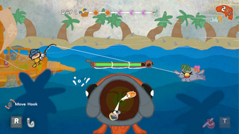
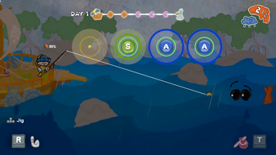
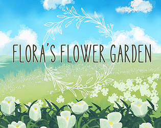
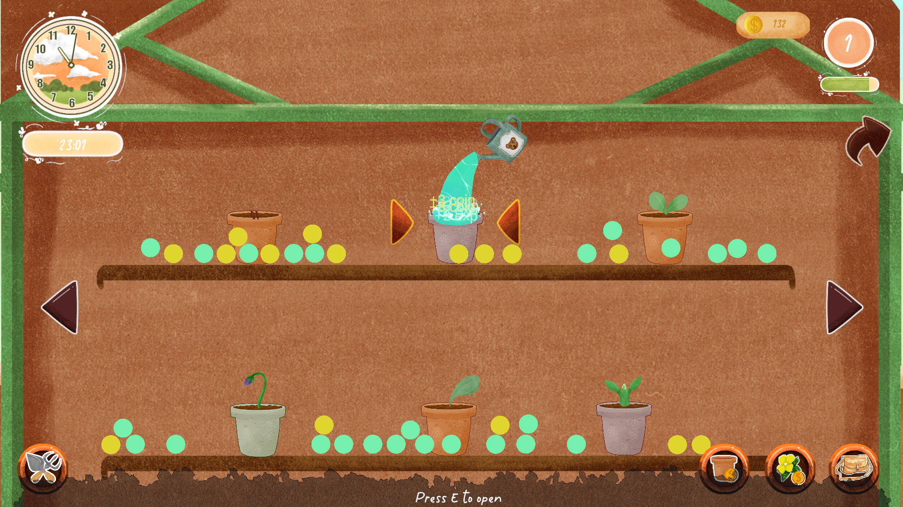

## 🎮 Solo Game Developer (Unity)

Hi, I'm Chaowanut Mukkhunthod you can call me Chain 👋  
I'm a solo game developer focused on building gameplay systems and technical art in Unity.

I enjoy designing scalable systems, optimizing performance, and learn how to creating tools that make game development smoother.
Currently working on small-to-mid scale indie projects.

## 🎮 What I Do

- Develop **gameplay UI and meta UI systems** for 2D and 3D games
- Implement **interactive UI feedback** to improve game feel and player clarity
- Work with **run-based / roguelite-inspired systems**
- Integrate UI with gameplay logic using **clean and modular architecture**
- Handle full-cycle development when working on solo projects

## 🌐 Socials:
  

# 💻 Tech Stack:
       

### Game Development
- Unity (2D / 3D)
- C# Game Programming
- Gameplay UI Implementation

### UI / UX & Animation
- Interactive UI Feedback
- DOTween
- PrimeTween

### Architecture & Tools
- Dependency Injection (VContainer) (Basic)
- Odin Inspector
- Modular & Scalable Architecture

# 📊 GitHub Stats:

### 🔝 Top Contributed Repo

---

### 🚀 Highlight Projects
- **Bubble Bomb**  
  

    
    &nbsp;&nbsp;&nbsp;&nbsp;
    
    &nbsp;&nbsp;&nbsp;&nbsp;
    
  

  

    🔗 Repo: <a href="https://github.com/MaFIaTH/Bubble">View Repository</a>
  

  

    🔗 Itch: <a href="https://github.com/MaFIaTH/Bubble">View Itch.io Page</a>
  

  

- **Around The Lighthouse**  

  

    
    &nbsp;&nbsp;&nbsp;&nbsp;
    
    &nbsp;&nbsp;&nbsp;&nbsp;
    
    &nbsp;&nbsp;&nbsp;&nbsp;
    
  

    🔗 Repo: <a href="https://github.com/Quack-Up-Game-Studio/Around-the-Lighthouse--Thesis-">View Repository</a>
  

  

    🔗 Itch: <a href="https://madduck-games-studio.itch.io/around-the-lighthouse">View Itch.io Page</a>
  

  
  

- **Flora Flower Garden**  
  

    
    &nbsp;&nbsp;&nbsp;&nbsp;
    
    &nbsp;&nbsp;&nbsp;&nbsp;
    
  

  

    🔗 Repo: <a href="https://github.com/chain3132/Flora-Flower-Garden">View Repository</a>
  

  

    🔗 Itch: <a href="https://tunasan.itch.io/flora">View Itch.io Page</a>
  

  
  

## 🧠 How I Work

- Strong ownership and responsibility
- Detail-oriented with focus on polish and usability
- Comfortable working independently or within a team
- Iterative mindset: test, refine, and improve
<!-- Proudly created with GPRM ( https://gprm.itsvg.in ) -->
